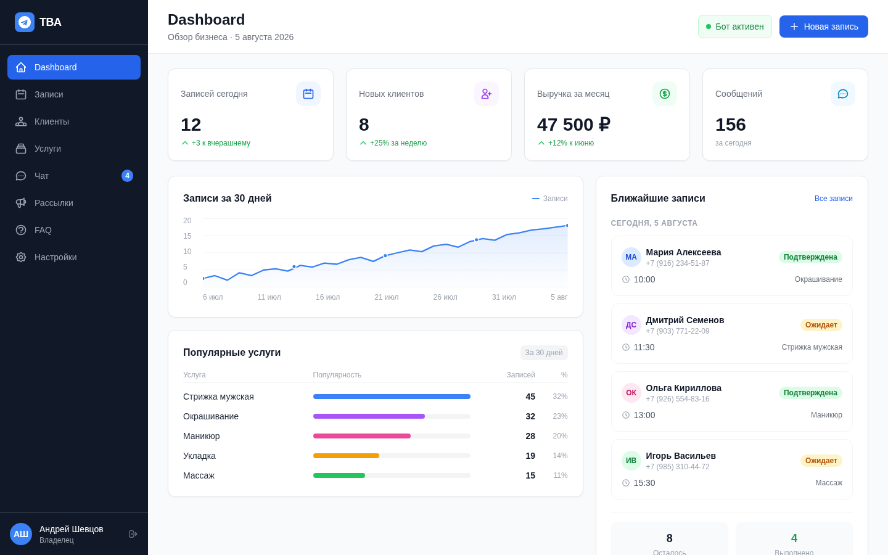
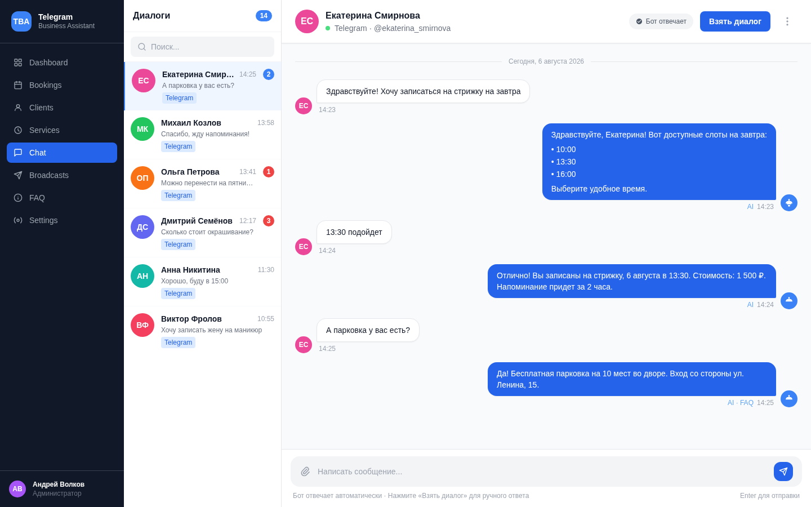

<!--
  BANNER: см. github_resume/DESIGN_SYSTEM.md — Telegram Business Assistant
  Сохранить как assets/banner.png и раскомментировать:
-->
<!--  -->

<div align="center">

> **[Русская версия / Russian version](README.md)**

# Telegram Business Assistant

### All-in-One Bot Platform for Service Businesses

[](https://github.com/AndrewSheff/telegram-business-assistant/actions)
[](https://python.org)
[](https://fastapi.tiangolo.com)
[](https://react.dev)
[](https://typescriptlang.org)
[](https://aiogram.dev)
[](https://postgresql.org)
[](https://docker.com)
[](LICENSE)

**Customers book appointments in Telegram. AI answers questions 24/7. Owners manage everything from a web admin panel.**

[Quick Start](#-quick-start) · [Features](#-features) · [Screenshots](#-screenshots) · [Architecture](#-architecture) · [API](#-api-documentation)

</div>

---

> **The Problem:** Service businesses spend 3-5 hours daily on manual appointment management. 40% of bookings happen outside business hours when nobody picks up the phone. 20-35% of appointments end in no-shows without reminders.

**Telegram Business Assistant** turns Telegram into a complete business management platform — customers book services, ask questions, and get reminders directly in the messenger, while owners run operations through a modern admin panel with CRM, analytics, and broadcasts.

<div align="center">

| Lines of Code | API Endpoints | DB Models | Admin Pages | Tests | Docker Services |
|:---:|:---:|:---:|:---:|:---:|:---:|
| **16,800+** | **55** | **14** | **16** | **48** | **5** |

</div>

---

## Screenshots

| Dashboard | Live Chat |
|:---------:|:---------:|
|  |  |

---

## Features

**Online Booking via Telegram** — customers browse services, pick a date and time slot, and confirm — without leaving Telegram. FSM-based flow with `SELECT FOR UPDATE` locking to prevent double-bookings.

**AI Assistant with Handoff** — Claude or GPT answers questions using the business knowledge base. When the AI can't help, it seamlessly hands the conversation to a live operator with full context preserved.

**Live Chat & Operator Panel** — real-time chat interface in the admin panel. Operators see active conversations, unread counts, and can take over from AI at any point.

**Broadcast Messaging** — send targeted announcements to all subscribers with rate-limited delivery (respects Telegram API limits). Track delivery stats per message.

**Built-in CRM** — automatic client profiles from Telegram interactions. Booking history, conversation logs, search and filtering by name, phone, or username.

**Schedule Management** — weekly working hours with lunch breaks. Date-specific overrides for holidays. The bot automatically shows only available time slots.

**Service Catalog** — services organized by categories with duration, price, and descriptions. Feeds directly into Telegram booking flow and admin analytics.

**FAQ & Knowledge Base** — structured FAQ with categories (checked before AI). Separate knowledge base blocks for detailed AI context.

**Dashboard & Analytics** — real-time metrics: bookings, new clients, revenue. Activity charts (7d/30d), popular services, booking status distribution.

**Automated Reminders** — APScheduler sends booking confirmations, 24-hour reminders, and 2-hour reminders. Automatic no-show detection.

**Multi-User Access** — Owner (full access) and Operator (chat and bookings) roles. Forced password change on first login.

**Enterprise Security** — JWT + bcrypt, rate limiting on auth endpoints, request ID tracing, structured JSON logging.

---

## Architecture

```
                      +------------------+
                      |     Nginx :80    |
                      |  Reverse Proxy   |
                      +--------+---------+
                               |
                +--------------+--------------+
                |                             |
        +-------+-------+           +--------+--------+
        | Frontend :3000|           |  Backend :8000  |
        |  React 19 SPA |           |  FastAPI + Bot  |
        +---------------+           +---+----+----+---+
                                        |    |    |
                          +-------------+    |    +-----------+
                          |                  |                |
                 +--------+---+    +---------+----+    +------+------+
                 | PostgreSQL |    |    Redis     |    |  Telegram   |
                 |   :5432    |    |    :6379     |    |  Bot API    |
                 |  14 models |    |  Rate Limit  |    +------+------+
                 +------------+    +--------------+           |
                                                       +------+------+
                                                       | APScheduler |
                                                       | Reminders   |
                                                       | Broadcasts  |
                                                       +-------------+
```

### Bot Flow

```
Customer message in Telegram
        |
        v
  [aiogram handler]
        |
        +---> /book       --> FSM: service -> date -> time -> confirm
        +---> /faq        --> FAQ categories and answers
        +---> /services   --> Service catalog with prices
        +---> /my_bookings --> List & cancel upcoming
        +---> free text   --> AI pipeline:
                                1. Check FAQ for match
                                2. Build context (schedule, services, KB)
                                3. Call Claude/GPT
                                4. If uncertain --> offer handoff
                                5. Operator takes over in admin panel
```

---

## Quick Start

### Prerequisites
- Docker & Docker Compose v2+
- Telegram bot token from [@BotFather](https://t.me/BotFather)
- (Optional) Anthropic or OpenAI API key for AI chat

### 1. Clone and configure

```bash
git clone https://github.com/AndrewSheff/telegram-business-assistant.git
cd telegram-business-assistant
cp .env.example .env
```

Edit `.env`:

```env
TELEGRAM_BOT_TOKEN=123456:ABC-DEF...     # required
SECRET_KEY=your-random-32-char-string    # required
ADMIN_EMAIL=admin@yourcompany.com
ADMIN_DEFAULT_PASSWORD=SecurePass123
ANTHROPIC_API_KEY=sk-ant-...             # optional, for AI chat
```

### 2. Launch

```bash
docker compose up -d
```

### 3. Access

| Service | URL |
|:--------|:----|
| Admin Panel | http://localhost |
| API Docs (Swagger) | http://localhost/docs |
| Health Check | http://localhost/api/v1/health |

Login with admin credentials from `.env`. Change password on first login, then configure your business in **Settings**.

---

## Tech Stack

| Layer | Technology | Version |
|:------|:-----------|:--------|
| **Backend** | Python, FastAPI, SQLAlchemy (async), Alembic | 3.13, 0.115, 2.0 |
| **Telegram** | aiogram, APScheduler | 3.19, 3.11 |
| **Frontend** | React, TypeScript, Vite, TailwindCSS, shadcn/ui | 19, 5+, 6, v4 |
| **Database** | PostgreSQL | 16 |
| **Cache** | Redis | 7 |
| **AI** | Anthropic Claude, OpenAI GPT | Latest |
| **Auth** | JWT (python-jose) + bcrypt | HS256 |
| **Infra** | Docker Compose, Nginx, GitHub Actions CI/CD | Multi-stage |
| **Logging** | structlog (JSON) | Request tracing |
| **Testing** | Pytest (async) | 48 tests, 10 files |

---

## API Documentation

Interactive Swagger at `/docs`. **55 endpoints** across 13 groups:

| Group | Prefix | Endpoints |
|:------|:-------|:----------|
| Auth | `/api/v1/auth` | Login, password change, token refresh |
| Dashboard | `/api/v1/dashboard` | Aggregated metrics and charts |
| Services | `/api/v1/services` | Service catalog CRUD with categories |
| Schedule | `/api/v1/schedule` | Weekly hours and day exceptions |
| Bookings | `/api/v1/bookings` | Management, status transitions |
| Clients | `/api/v1/clients` | Profiles and booking history |
| FAQ | `/api/v1/faq` | FAQ CRUD with categories |
| Knowledge | `/api/v1/knowledge` | AI knowledge base blocks |
| Broadcasts | `/api/v1/broadcasts` | Mass messaging campaigns |
| Chat | `/api/v1/chat` | Live chat, conversations, handoff |
| Settings | `/api/v1/settings` | Business profile configuration |
| Users | `/api/v1/users` | Admin user management and roles |
| Health | `/api/v1/health` | Liveness and readiness probes |

---

## Project Structure

```
telegram-business-assistant/
├── backend/
│   ├── app/
│   │   ├── main.py              # FastAPI app with lifespan
│   │   ├── config.py            # Pydantic settings
│   │   ├── database.py          # Async SQLAlchemy engine
│   │   ├── api/v1/              # 13 REST API routers
│   │   ├── bot/                 # Telegram bot
│   │   │   ├── bot.py           # Bot initialization
│   │   │   ├── handlers/        # Message & callback handlers
│   │   │   ├── keyboards/       # Inline & reply keyboards
│   │   │   └── states/          # FSM states for booking
│   │   ├── models/              # 14 SQLAlchemy models
│   │   ├── schemas/             # Pydantic v2 schemas
│   │   ├── services/            # Business logic layer
│   │   ├── tasks/               # APScheduler tasks
│   │   └── core/                # Security, logging, exceptions
│   ├── tests/                   # 48 pytest tests (10 files)
│   ├── Dockerfile
│   └── entrypoint.sh
├── frontend/
│   ├── src/
│   │   ├── api/                 # Axios API clients
│   │   ├── components/          # UI components + layout
│   │   ├── contexts/            # Auth context provider
│   │   ├── pages/               # 16 page components
│   │   └── lib/                 # Utilities
│   └── Dockerfile
├── docker/nginx/
├── .github/workflows/           # CI/CD (lint + test + build)
├── docker-compose.yml           # 5 services with health checks
└── .env.example
```

---

## Environment Variables

| Variable | Required | Default | Description |
|:---------|:---------|:--------|:------------|
| `TELEGRAM_BOT_TOKEN` | Yes | -- | Bot token from @BotFather |
| `SECRET_KEY` | Yes | -- | JWT signing key (min 32 chars) |
| `ADMIN_EMAIL` | No | `admin@company.com` | Initial owner email |
| `ADMIN_DEFAULT_PASSWORD` | No | -- | Initial owner password |
| `DATABASE_URL` | No | Auto | PostgreSQL connection |
| `REDIS_URL` | No | Auto | Redis connection |
| `ANTHROPIC_API_KEY` | No | -- | For Claude AI chat |
| `OPENAI_API_KEY` | No | -- | For GPT AI chat |
| `TIMEZONE` | No | `UTC` | Business timezone |
| `LOG_LEVEL` | No | `INFO` | Logging verbosity |

---

## Development

```bash
# Backend
cd backend
python -m venv .venv && source .venv/bin/activate
pip install -r requirements.txt
docker compose up -d postgres redis
uvicorn app.main:app --reload --port 8000

# Frontend
cd frontend && npm install && npm run dev

# Tests
cd backend && pytest tests/ -v

# Lint
ruff check backend/
cd frontend && npm run lint && npx tsc --noEmit
```

---

## License

[MIT](LICENSE) — free for commercial use.
